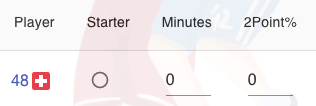

# BLOB Player Manual

**BLOB** (Basketball League On Blockchain) is a fantasy basketball game that runs completely on blockchain. You can build your own team to win championships by managing your roster on the court, drafting new prospects, or trading players. Each team and each player is an [ERC721 NFT](https://ethereum.org/en/developers/docs/standards/tokens/erc-721/)，which can be transferred within the game or via a third-party market.

## Prerequisites

This game can be run on a mobile or desktop browser. First of all, you need to install an encrypted wallet (if you don't connect to the wallet, you can only watch the game play but cannot participate). We recommend downloading the [Metamask](https://metamask.io/) App on mobile; or your can choose Metamask's Chrome or Firefox plug-in on desktop. Currently the Beta version of this game is deployed on the [BSC Test](https://docs.binance.org/guides/testnet.html) chain, you need to add its network on Metamask. For the mobile app, click the menu on the upper left corner, or click the icon on the upper right corner of the web plug-in, and select _Settings->Network->Add Network_.

The _RPC URL_ is https://data-seed-prebsc-1-s1.binance.org:8545/. After the network is added, you can use your wallet address to get some test tokens from the [faucet](https://testnet.binance.org/faucet-smart) of BSC Testnet. Note: since it is a test chain, the token has no real value. After the setting is complete, reload the _blob_ homepage, (on mobile you need to click the _blob_ icon on the upper right corner to choose to connect to the Metamask wallet). When the icon turns from orange to white, it means that it has been connected to the chain.

## Teams

You can claim a team in a pre-season. Click the _main Menu->Teams->Claim Team_ tab. Only one team can be claimed for each address. Upon success, the NFT of that team belongs to your address.

Each team will be given 12 players, two for each position on the court, and the remaining two are randomly assigned. Details can be viewed in the _Main Menu->My Team_.

### Players

The player’s NFT does not directly belong to the your address, but instead to the Team Contract. After a player retires, this player can be transferred to your personal address, similar as a NBA star card.  
Player attributes are divided into _basic attributes_ and _variable attributes_.

##### Basic Attributes

This type of attribute is randomly generated when a player is minted and remains unchanged over the player's career. The value of each item is between 0-100. The higher the value, the stronger the ability. They include:

- _Two Point Shot_
- _Three Point Shot_
- _Assist_
- _Rebound_
- _Block_
- _Steal_
- _Free Throw_

Among them, two point shot, three point shot, and assist are **offensive abilities** , while rebound, block, and steal are **defensive abilities**. In addition to determining each player's performance for a game, these attributes will also contribute to the overall offense and defense of a team.

##### Variable Attributes

This type of attribute is randomly generated when the a player is minted, and changes at the end of each season. Each value is between 0-100. The higher the value of _physical fitness_ or _maturity_, the stronger the ability. They include:

- _Age_ ：the age of a player will increment by one after the end of each season until the player retires. The retirement age is randomly determined between 38 and 42.

- _Physical Fitness_ ：determines the probability of a player's injury. Players with good physical fitness are less likely to be injured after a longer game minutes. This attribute will increase with age, reaching a peak around 30, and then gradually decline.

- _Maturity_ ：determines the consistency of a player's performance in each game, that is, the fluctuation of their game stats. Generally, players who have just joined the league have poor consistency. Consistency grows with the total playing minutes of a player in each season. Its growing rate peaks at around 30 years of age, and then slowing down.

### Roster Management

You can manage your roster on the court by setting the following values:

- _Starter_ : each position has one starter and only they can play overtime if the regular time is tied.

- _Minutes_ : between 0-48. 0 means not playing in game. The minutes of players in the same position must add up to 48.

- _Two-point Shots Allocation_ : the percentage of all players' allocations must add up to 100%.

- _Three-point Shots Allocation_ : the percentage of all players' allocations must add up to 100%.

- _Team Three-point Shots Allocation_ : the percentage of team three-point shots allocation over all shots. Teams with outstanding three-point shooters can increase this threshold.

  **Note** : The allocation of shots taken by a single player (two points + three points) cannot exceed 25% of the team's total shots. In addition, the proportion of players' shots must be less than 1/4 of the proportion of their minutes. For example: if given 10% shots, this player must play at least 40% of game time (approximately 20 minutes), in line with a real game.

When you tweak those values, the page will automatically validate against the above rules. If the validation fails, it will prompt on the page:

Only the settings that has passed the validation can be submitted:

##### Team Shots

The method of calculating the number of team attempts per game is as follows:  
**Regular time** : Attempts Base = 100, Free Throw Attempts Base = 25  
**Overtime** : Attempts Base = 10, Free Throw Attempts Base = 5  
_Team Offense Score_ = SUM (player's **offensive abilities** × player minutes%)  
_Team Defense Score_ = SUM (player's **defensive abilities** × player minutes%)  
_Winning Streak_ = the team's most recent winning streak, as a morale bonus, up to 10  
_Team Shots_ = _Attempts Base_ × (your team's _Offense Score_ / opponent's _Defense Score_) + your team's _Winning Streak_  
_Team Free Throws_ = _Free Throw Attempts Base_ × (your team's _Offense Score_ / opponent's _Defense Score_)

##### Player Personal Stats

The factors that determine a player's game stats include:

- _Basic Attributes_ : the higher the value, the higher the base of the data.

- _On-The-Spot Play_ : randomly generated for each player in each game. It can fluctuate between 60% and 130% out of the basic attributes.

- _Maturity_ : It can offset some of the on-the-spot fluctuations, and the 100 value of maturity can limit the fluctuations to within between 90% and 100%.

- _Playing Minutes_ : The number of assists, rebounds, blocks, and steals is directly proportional to the playing minutes on top of the basic attributes.

#### Scores

_Team Score_ = SUM ( player's two-point attempts × individual two-point percentage × 2 + player's three-point attempts × individual three-point percentage × 3 + player free throws × individual free throw percentage )

\* A player's free throws is in proportion to their shot allocation.  
\*\* If the regular time is tied, the overtime scores will be calculated per the above method as well with the overtime shot base, until the winner is determined.

#### Injuries

Injuries are determined by a combination of physical fitness and playing minutes. The maximum safe playing minutes of a player is 45 minutes. On this basis, the actual safe playing minutes is calculated by weighting _On-The-Spot Play_ and _Physical Fitness_. If the set playing minutes exceeds this value, there are:

- 1/7 probability of missing 1 round
- 1/11 probability of missing 5 rounds
- 1/13 probability of missing 10 rounds

When a player cannot play in the next round, an injury icon will appear after the player ID on the roster management tab. The player’s profile page shows their next available round.

## Schedule

The schedule is pre-set before the start of the season. It is a double round-robin system, with each pair of teams being divided into a home and a away game. In order to facilitate the calculation of the next available round of injury time, the participating teams are required to be an even number, so that every team has a game in each round and there will be no byes.

### Game Results

The game is automatically executed by the system at the scheduled time without your involvement. After the game is over, the game statistics will be displayed, you can click to view the detailed data of the game:

### Abstain

A loss will be judged if you fail to adjust the team to qualify for the game before it's scheduled, for example, due to a player’s injury, the number of players on your roster is insufficient. Your opponent in compliance with the rules is judged as a win, and its score is still calculated according to the method in the _Scores_ section; if it is not in compliance, it is judged as a loss as well.

## Standings

The team standings are sorted by the winning percentage of the teams, and the team that ranks first at the end of the season is the champion.

## Technical Stats

Technical statistics can show the ranking of all players in the league in a single season.

## Draft

The draft will be conducted at a fixed time the day after the end of the season, and ends on the same day.

### Prospects

When the last game of the season is over, the system will automatically mint a number of prospect players that equals the number of teams × 5 (one for each position) for evaluation by each team. The player generation method is as follows:

#### Basic attributes

The **offensive abilities** and **defensive abilities** are divided into four grades from high to low, randomly generated in their respective intervals:

- A: > 85, accounting for about 10% of the prospect players
- B: 70 ~ 85, accounting for about 20% of the prospect players
- C: 55 ~ 70, accounting for about 50% of the prospect players
- D: 40 ~ 55, accounting for about 20% of the prospect players.

The offensive and defensive abilities of a single player are generated independently of each other.

#### Variable attributes

Attributes are randomly generated in their respective intervals:

- _Age_ : 18 ~ 22
- _Physical Fitness_ : 50 ~ 100
- _Maturity_ : 20 ~ 40

#### Choose Player

Each team selects players in descending order of the ranking in this season. Each team has a 10-minute pick window. Failure to select after the window closes will be deemed as a waiver, and the next team will automatically start selecting. Each team can have up to 16 players, and players cannot be dismissed. The only way to get a player to leave the team is to retire or trade, so you need to choose players cautiously based on the team's position requirements and age structure.

## Trade

Teams can trade player by bartering with other teams at any time during the season.

### Initiate transaction

You can choose _Trade -> Exchange Players_ tab, select the opposing team, players and your own players. Many-to-many player trades are supported.

### View Current Transactions

You can view all current transactions in the transaction list and handle transactions which your team involves.

### Transaction Status

- Active: a deal that has not been handled after initiation
- Cancelled: a deal cancelled by the initiating team
- Accepted: a deal accepted by the opposing team
- Rejected: a deal rejected by the opposing team
- Expired: all deals expire automatically at the end of the season

  **Note** : Each team can have up to 10 active transactions at the same time . Once a transaction is accepted by the opponent, the players will automatically exchange, unless an exception occurs when it's accepted, such as:

  1.  The traded player has been exchanged in other trades initiated at the same time and no longer belongs to the team.
  2.  The receiving team has reached its maximum player limit.
