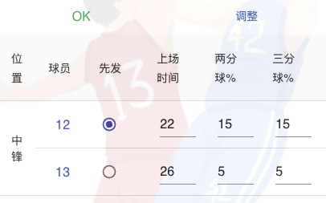

# BLOB 玩家手册

**BLOB** (Basketball League On Blockchain)是一个完全运行在链上的篮球经理游戏。玩家通过申领球队，管理队员的场上时间，选秀和买卖球员，来运作整支球队取得联赛的胜利。每支球队和每名球员均为一个[ERC721 NFT](https://ethereum.org/zh/developers/docs/standards/tokens/erc-721/)，玩家可以通过游戏或者三方市场进行转让。

## 基本设置

游戏可以在移动端或者桌面浏览器上运行。首先你需要安装一个加密钱包（如不连接钱包，你只能以观赛的方式浏览而无法参与游戏），移动端推荐下载[Metamask](https://metamask.io/) App，桌面版推荐使用 Metamask 的 Chrome 或者 Firefox 插件。
本游戏 Beta 版现部署在[BSC Test](https://docs.binance.org/guides/testnet.html)链上，你需要在 Metamask 上添加这个网络。移动 App 点击左上角菜单，网页插件点击右上角图标，选择*设置->网络->添加网络*。

*RPC URL*为 https://data-seed-prebsc-1-s1.binance.org:8545/。添加完成以后可以用你的钱包地址在 BSC Testnet 的[faucet](https://testnet.binance.org/faucet-smart)上进行充值。注意：由于是测试链，代币并无实际价值。
设置完成后重新载入[blob](https://blob.oughtto.be/)主页，（移动端需要点击右上角 blob 图标选择连接 Metamask 钱包），当图标由橙色变为白色表示已经连到链上。

## 球队

玩家可以在赛季前申领球队。点击*主菜单->球队->申领球队*栏。每个地址只能申领一支球队，成功以后该球队 NFT 属于玩家地址。

每个球队会预先分配 12 名球员，其中每一个场上位置各 2 名，剩余 2 名为随机分配。详情可以在*主菜单->我的球队*中查看。

### 球员

球员 NFT 属于 Team Contract，并不直接属于玩家地址，当球员退役以后玩家可以将其转入个人地址，类似一张球星卡。球员属性分基本属性和可变属性。

##### 基本属性

此类属性随球员生成时随机产生并保持不变，每一项数值在 0-100 之间，数值越高表明此项能力越强。包括：

- _两分_
- _三分_
- _助攻_
- _篮板_
- _封盖_
- _抢断_
- _罚球_

其中两分、三分、助攻为**进攻能力**，篮板、封盖、抢断为**防守能力**，每个球员的个人能力除了决定其每场的比赛数据，也会影响全队的进攻和防守能力。

##### 可变属性

此类属性随球员生成时随机产生，在赛季结束时发生变化，每一项数值在 0-100 之间，体能和稳定性的数值越高表明此项能力越强。包括：

- _年龄_ ：球员的年龄会在每个赛季结束后增加一岁，直至球员退役。退役年龄在 38 至 42 间随机决定。
- _体能_ ：决定球员的伤病的概率，体能好的球员在安排较长上场时间后不容易受伤。球员的体能会随年龄增长而增加，在 30 岁左右达到峰值，之后逐渐下降。
- _稳定性_ ：决定球员每场发挥的稳定性即数据表现的起伏，一般刚入盟的球员稳定性较差。稳定性随着球员每个赛季的上场时间而增长，在 30 岁左右增速达到峰值，之后增速减慢。

### 球队管理

玩家可以通过设置以下数值来管理球员的场上表现：

- _先发_ ：当常规时间结束时两队比分相同，仅先发球员能参加加时赛。
- _上场时间_ ：0-48 之间。0 表明未上场。同一位置的球员上场时间相加要达到 48 分钟。
- _两分球出手百分比_ ：所有上场球员出手比例相加要达到 100%。
- _三分球出手百分比_ ：所有上场球员出手比例相加要达到 100%。
- _全队三分球出手占比_ ：全队三分球出手占总出手百分比。有三分球能力突出球员的球队可以调高此阈值。

  **注意**：单个球员的出手比例（两分+三分）不能超过全队总出手的 25%。另外球员出手比例分配必须低于上场时间比例的 1/3。例如：如果设置 10%的出手比例, 该球员必须打满至少 30%的场上时间（约 15 分钟）。

当玩家调整数值时，页面会自动根据上述规则进行检验，当检验失败时，会在页面上进行提示：

只有检验通过后的数值才可以提交：

##### 全队出手次数

计算球队每场出手次数的方法为：  
**常规时间**：出手次数基数 = 100，罚球出手基数 = 25  
**加时**：出手次数基数 = 10，罚球出手基数 = 5  
全队进攻能力值 = SUM(球员个人**进攻能力**值 × 球员上场时间%)  
全队防守能力值 = SUM(球员个人**防守能力**值 × 球员上场时间%)  
连胜场次 = 球队最近连胜的场次，作为士气加分，最多为 10  
全队出手次数 = 出手次数基数 ×（本方全队进攻能力值 / 对手全队防守能力值）+ 本队连胜场次  
全队罚球次数 = 罚球出手基数 ×（本方全队进攻能力值 / 对手全队防守能力值）

##### 球员个人数据

决定每名球员各项比赛数据的因素包括以下：

- _基本属性_ ：数值越高代表该项数据的基数越高。
- _临场发挥_ ：针对每个球员每场随机产生。最多可以在基本属性的 60%～ 130%间浮动。
- _稳定性_ ：可以抵消部分临场发挥浮动，100 数值稳定性可以限制临场发挥浮动在 90%～ 100%。
- _上场时间_ ：助攻、篮板、封盖、抢断次数在基本属性基础上同上场时间成正比。

#### 比分

球队得分 = SUM(球员两分出手次数 × 个人两分命中率 × 2 + 球员三分出手次数 × 个人三分命中率 × 3 + 球员罚球次数 × 个人罚球命中率)  
\*其中球员罚球次数按照个人出手次比例分配。若常规时间打平，则以加时的出手基数按照上述方法计算加时得分，直至分出胜负。

#### 伤病

伤病由体能和上场时间综合决定。球员最大安全比赛时间为 45 分钟，在此基础上由临场发挥和体能加权计算出本场的安全比赛时间，如果设置的上场时间超过这个值，有：

- 1/7 概率停赛 1 轮
- 1/11 概率停赛 5 轮
- 1/13 概率停赛 10 轮

当球员无法在下一轮上场时，球队管理页面上该球员 ID 后会出现伤病图标。球员的详情页上有下个上场轮次的显示。

## 赛程

赛程由赛季开始前预先设定，为双循环制，每个球队之间分主客场各一场比赛。为方便计算伤病的下轮上场时间，要求参赛球队为偶数，这样每一轮各支球队都有比赛，不会出现轮空。

### 比赛结果

比赛在预定的时间由系统自动执行，无需玩家操作。比赛结束后会显示出比赛数据统计，你可以点击查看比赛详细数据：

### 弃权

如果玩家未能在比赛开始前将球队调整到符合比赛资格的状态，例如因为球员伤病造成上场人数不足，比赛执行时将自动视该队为弃权，判定负一场比赛；而另一方如果合规则判定为胜场，仍按**比分**小节中的计算方法计算得分；若不合规也判为负。

## 排名

球队排名按球队的胜率由高到低排序，赛季末排名第一的球队为冠军。

## 技术统计

技术统计可以展示联盟中所有球员在单个赛季中各项数据的排名

## 选秀

选秀会在赛季结束后的一天的固定时间进行，并于当天结束。

### 参选球员

当本赛季最后一场比赛结束以后，系统会自动为每个场上位置生成与球队数量相等的参选球员（个数 = 5 × 球队数），供各支球队评估。球员生成方法如下：

#### 基本属性

**进攻属性**和**防守属性**由高到低分四个等级，在各自区间中随机生成：  
 A：> 85，约占参选球员 10%  
 B：70 ～ 85，约占参选球员 20%  
 C：55 ～ 70，约占参选球员 50%  
 D：40 ～ 55，约占参选球员 20%  
 单个球员的进攻和防守等级独立生成，互不相关。

#### 可变属性

属性在各自区间中随机生成：  
_年龄_ ：18 ～ 22  
_体能_ ：50 ～ 100  
_稳定性_ ：20 ～ 40

#### 选择球员

各队按本赛季排名由低到高的次序先后选择球员，每队有 10 分钟的选择时间，过期未选择视为弃权，自动由下个球队进行选择。每支球队最多可拥有 16 名球员，且无法解雇球员，唯一让球员离队的方法是退役或者交易，所以玩家需要根据球队的位置需求和年龄结构合理选择球员。

## 交易

球队可以在本赛季的任意时段同其它球队进行**人换人**的球员交易。

### 发起交易

玩家选择*交易->交换球员*栏，选择对方球队、球员以及本方球员，支持多对多的交易球员。

### 查看当前交易

玩家可以在交易列表中查看当前的所有交易，并处理与本队相关的交易。

### 交易状态

- 有效：发起后尚未被处理的交易
- 已取消：被发起球队自行取消的交易
- 已接受：被对方球队接受的交易
- 已拒绝：被对方球队拒绝的交易
- 已过期：所有交易在赛季结束时自动过期

  **注意**：每支球队最多同时可以有**10**条有效交易。交易一旦被对方接受，球员会自动进行交换，除非被接受时有例外发生，例如：

  1.  交易球员已经在同时发起的其它交易中被交换，而不再属于该球队
  2.  接收球队任一方球员已满额
